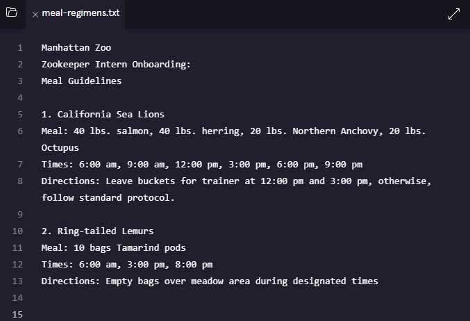
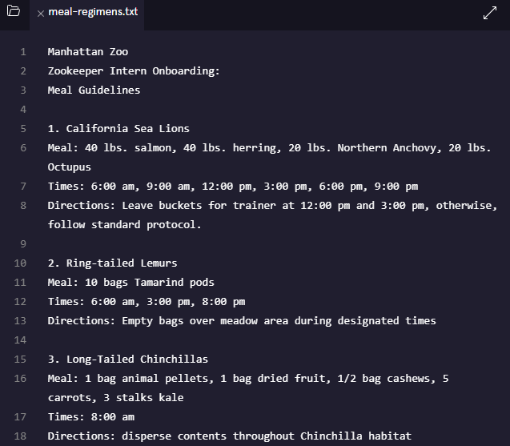
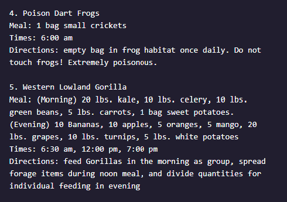

# Manhattan Zoo

In this project, you’ll use Git to keep track of meal guidelines for animals at the Manhattan Zoo.

This is the file we will be modifying and tracking



## 1. Initialize a new Git repository.
```
$ git init
Initialized empty Git repository in /home/ccuser/workspace/manhattan-zoo-1/.git/
```

## 2. Check the status of the repository.
```
$ git status
On branch master

Initial commit

Untracked files:
  (use "git add <file>..." to include in what will be committed)

        meal-regimens.txt

nothing added to commit but untracked files present (use "git add" to track)
```

### 3. Add meal-regimens.txt to the staging area.
```
$ git add meal-regimens.txt
```

### 4. Make a commit
```
$ git commit -m "adding meal-regimens.txt"
[master (root-commit) ef14b66] adding meal-regimens.txt
 1 file changed, 14 insertions(+)
 create mode 100644 meal-regimens.txt
```

### 5. Updating meal-regimens.txt.


### 6.
Add meal-regimens.txt to the staging area.
```
$ git add meal-regimens.txt 
```

### 7. Check the status of the Git project
```
$ git status
On branch master
Changes to be committed:
  (use "git reset HEAD <file>..." to unstage)

        modified:   meal-regimens.txt
```
### 8. Make a commit.
```
$ git commit -m "meal-regimens.txt updated with 3rd paragraph"
[master 1ebab32] meal-regimens.txt updated with 3rd paragraph
 1 file changed, 4 insertions(+)
```
### 9. View your Git commit history.
```
$ git log
commit 1ebab3257597009d7978a7531a4a08141c2e22b8
Author: codecademy <ccuser@codecademy.com>
Date:   Wed Jun 12 19:42:54 2024 +0000

    meal-regimens.txt updated with 3rd paragraph

commit ef14b666eb64444b0bd6289c1511eeb7216facaa
Author: codecademy <ccuser@codecademy.com>
Date:   Wed Jun 12 19:35:14 2024 +0000

    adding meal-regimens.txt
```
### 10.  Here’s two more animal reports. Include each in meal-regimens.txt, making a new commit for each animal added.


After adding paragraph 4. and saving file
```
$ git add meal-regimens.txt 
$ git commit -m "meal-regimens.txt updated with 4th paragraph"
[master 7acadad] meal-regimens.txt updated with 4th paragraph
 1 file changed, 5 insertions(+)
```

After adding paragraph 5. and saving file
```
$ git commit -m "meal-regimens.txt updated with 5th paragraph"
[master 1aca9f0] meal-regimens.txt updated with 5th paragraph
 1 file changed, 6 insertions(+), 1 deletion(-)
```
```
$ git log
commit 1aca9f0d254fa930a8a9d4bedee7bd1dfb41db6d
Author: codecademy <ccuser@codecademy.com>
Date:   Wed Jun 12 19:48:59 2024 +0000

    meal-regimens.txt updated with 5th paragraph

commit 7acadad2a00cd0e77c0d194b86ba3a77b58d006e
Author: codecademy <ccuser@codecademy.com>
Date:   Wed Jun 12 19:47:50 2024 +0000

    meal-regimens.txt updated with 4th paragraph

commit 1ebab3257597009d7978a7531a4a08141c2e22b8
Author: codecademy <ccuser@codecademy.com>
Date:   Wed Jun 12 19:42:54 2024 +0000

    meal-regimens.txt updated with 3rd paragraph

commit ef14b666eb64444b0bd6289c1511eeb7216facaa
Author: codecademy <ccuser@codecademy.com>
Date:   Wed Jun 12 19:35:14 2024 +0000

    adding meal-regimens.txt
```