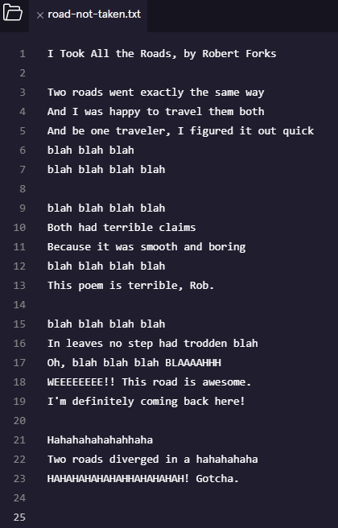
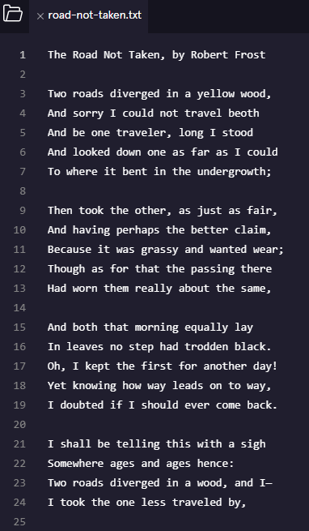
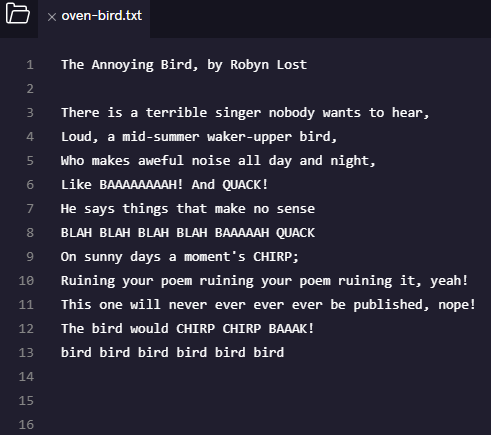
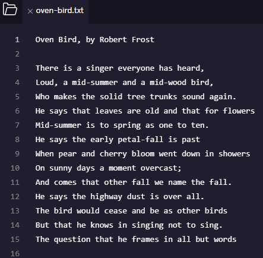
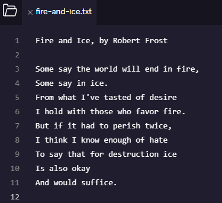

# Poem Fiasco
Let’s get some practice with Git backtracking.
In this project, changes have been made to a series of poems and you want to change them back.

They 3 poems are contained in the following files:
- road-not-taken.txt
- oven-bird.txt 
- fire-and-ice.txt

### 1. Discard changes to road-not-taken.txt
The file road-not-taken.txt doesn’t look right at all! Perhaps a rival poet snuck in and changed it while you were getting coffee. Good thing you’ve been committing often.

Discard changes made to the working directory.
```
$ git checkout HEAD road-not-taken.txt
```
Now close and reopen the file. The following shows the before and after.

 

### 2. Add line to road-not-taken.txt
Now, finish the poem by adding the last line `And that has made all the difference.` and save the file.

### 3. Discard changes to oven-bird.txt
The file oven-bird.txt has also been tampered with. Let's discard the changes in the working directory again, using the shortcut `--` instead of `HEAD`.
```
$ git checkout -- oven-bird.txt
```
Now close and reopen the file. The following shows the before and after.

 

### 4. Add line to oven-bird.txt
Now, finish the poem by adding the line `Is what to make of a diminished thing.` and save the file.

### 5. Check if fire-and-ice.txt has been altered
The file fire-and-ice.txt has not been altered, but just to be sure, check the difference between the working directory and the staging area.
```
$ git diff fire-and-ice.txt
```
This yields no output so there is none.

Now, add these last two lines to the poem and save the file.
```
Is also okay
And would suffice.
```
Below is the current state of the file:



### 6. Add files to staging area
Now that you’ve restored and completed road-not-taken.txt and oven-bird.txt and added a line to fire-and-ice.txt, add all three of the files to the staging area.
```
$ git add road-not-taken.txt oven-bird.txt fire-and-ice.txt
```
```
$ git status
On branch master
Changes to be committed:
  (use "git reset HEAD <file>..." to unstage)

        modified:   fire-and-ice.txt
        modified:   oven-bird.txt
        modified:   road-not-taken.txt
```

### 7. Remove file from staging area
The file fire-and-ice.txt could be better. Before you commit, remove this file from the staging area.
```
$ git reset -- fire-and-ice.txt
Unstaged changes after reset:
M       fire-and-ice.txt
```
```
$ git status
On branch master
Changes to be committed:
  (use "git reset HEAD <file>..." to unstage)

        modified:   oven-bird.txt
        modified:   road-not-taken.txt

Changes not staged for commit:
  (use "git add <file>..." to update what will be committed)
  (use "git checkout -- <file>..." to discard changes in working directory)

        modified:   fire-and-ice.txt
```

### 8. Make a commit
Now that you’ve removed fire-and-ice.txt, make a commit.
```
$ git commit -m "Adding work to Oven Bird and Road Not Taken"
[master 504c05b] Adding work to Oven Bird and Road Not Taken
 2 files changed, 2 insertions(+)
```

### 9. Make drasctic changes to all poems
Suddenly you have decided you are unhappy with all poems. You therefore delete all content from all files and save the changes.

### 10. Add files to staging area
Now add all three files to the staging area.
```
$ git add -A
```
```
$ git status
On branch master
Changes to be committed:
  (use "git reset HEAD <file>..." to unstage)

        modified:   fire-and-ice.txt
        modified:   oven-bird.txt
        modified:   road-not-taken.txt
```

### 11. Make a commit
Commit all changes.
```
$ git commit -m "Deleted all content"
[master 177e70b] Deleted all content
 3 files changed, 50 deletions(-)
 rewrite oven-bird.txt (100%)
 rewrite road-not-taken.txt (100%)
```

### 12. Reset your project
A little later you take a look at the current state of your poems and regret your last commit. Reset your Git project to the commit before you made those drastic changes.
```
$ git reset HEAD~1
Unstaged changes after reset:
M       fire-and-ice.txt
M       oven-bird.txt
M       road-not-taken.txt
```
We could also have found the first 7 characters of the SHA with `git log` and reverted to a specific commit.

Let's check out the last commit in our log.
```
$ git log -1
commit 504c05b51a01ae3f8a02160ffd8b399b8db08318
Author: codecademy <ccuser@codecademy.com>
Date:   Mon Jul 14 10:42:19 2025 +0000

    Adding work to Oven Bird and Road Not Taken
```

### 13. Restore files to HEAD commit version
There’s a problem. You reset HEAD to a previous commit, but the changes you want to get rid of are still in the working directory.
Discard the changes to the working directory and restore the files to the way they look in the HEAD commit.
```
$ git checkout -- fire-and-ice.txt oven-bird.txt road-not-taken.txt
```
And our files have been restored.