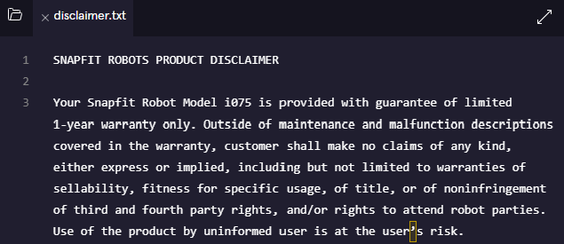
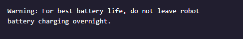

# SnapFit Robots, Inc.
Now that you’ve had more practice with the Git workflow, let’s solidify your new skills even more.

In this project, you will be working on assembly instructions for Snap-Fit Robots Inc., a build-it-yourself robot company.

There are 3 files in the directory: disclaimer.txt, instructions.txt and warranty.txt. Below is a snapshot of discalimer.txt at the beginning of the project



### 1. Initialize a new Git project.
```
$ git init
Initialized empty Git repository in /home/ccuser/workspace/snapfit-robots/.git/
```

### 2. Check the status of the Git project.
You will see multiple files listed in the output as “Untracked”.
```
$ git status
On branch master

Initial commit

Untracked files:
  (use "git add <file>..." to include in what will be committed)

        disclaimer.txt
        instructions.txt
        warranty.txt

nothing added to commit but untracked files present (use "git add" to track)
```

### 3. Add each file to the Git staging area.
```
$ git add disclaimer.txt instructions.txt warranty.txt 
```

### 4. Check the status of the Git project again.
```
$ git status
On branch master

Initial commit

Changes to be committed:
  (use "git rm --cached <file>..." to unstage)

        new file:   disclaimer.txt
        new file:   instructions.txt
        new file:   warranty.txt
```

### 5. Make a commit.
```
$ git commit -m "Adding disclaimer, instructions and warranty"
[master (root-commit) de7e290] Adding disclaimer, instructions and warranty
 3 files changed, 70 insertions(+)
 create mode 100644 disclaimer.txt
 create mode 100644 instructions.txt
 create mode 100644 warranty.txt
```

### 6. View your Git commit log.
```
$ git log
commit de7e2906a3cd9053a03578091eda8bfe4ae524d6
Author: codecademy <ccuser@codecademy.com>
Date:   Thu Jun 13 14:04:57 2024 +0000

    Adding disclaimer, instructions and warranty
```
### 7. Include this line in disclaimer.txt:


and save disclaimer.txt

### 8. Add the file to the staging area.
```
$ git add disclaimer.txt 
```

### 9. Now make a commit.
```
$ git commit -m "Warning added to disclaimer file"
[master 3335535] Warning added to disclaimer file
 1 file changed, 1 insertion(+), 1 deletion(-)
```

### 10. View your Git commit log again to identify your commit.
```
$ git log
commit 3335535c59fa55535ae22bae69c69feb040511f9
Author: codecademy <ccuser@codecademy.com>
Date:   Thu Jun 13 14:11:09 2024 +0000

    Warning added to disclaimer file

commit de7e2906a3cd9053a03578091eda8bfe4ae524d6
Author: codecademy <ccuser@codecademy.com>
Date:   Thu Jun 13 14:04:57 2024 +0000

    Adding disclaimer, instructions and warranty
```

### 11. Revise each file in whatever ways you’d like. Then add your changes to the staging area and make another commit.
Added voice command to instruction.txt and saved file.
```
$ git add instructions.txt 
$ git commit -m "Voice command added to instructions.txt"
[master f5b2454] Voice command added to instructions.txt
 1 file changed, 2 insertions(+)
```